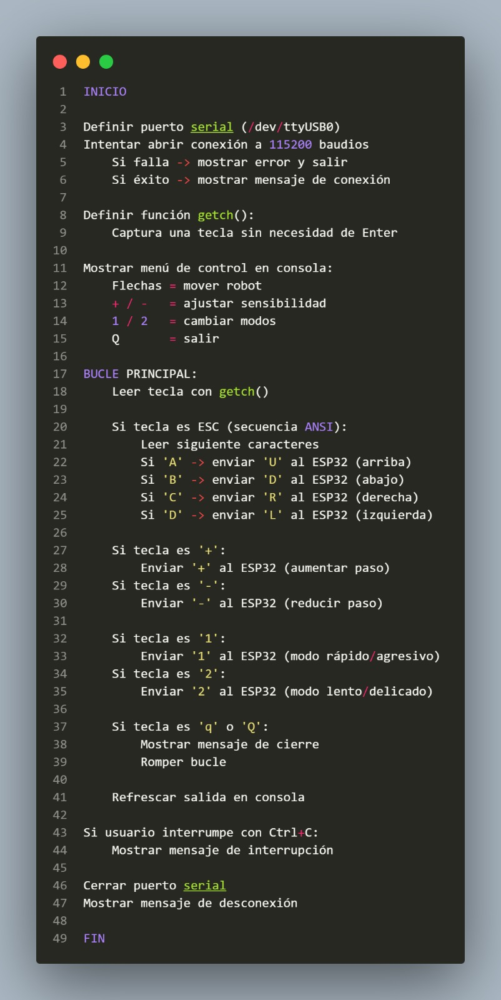

# 📷 Configuración de Cámara CSI con Deepstream y YOLO

Este repositorio contiene la implementación técnica para la detección de drones en tiempo real utilizando cámaras CSI y el framework NVIDIA Deepstream en dispositivos Jetson.

---

###  1. Lógica y Pseudocódigo
Antes de la codificación, se estableció el flujo lógico para asegurar una correcta captura de frames y una inferencia de baja latencia.


---

### 2. Código de Implementación (`csi.py`)
El script principal gestiona el Pipeline de GStreamer, configura los sensores CSI y utiliza un **Probe** para extraer metadatos de detección y dibujarlos en pantalla mediante el OSD (On-Screen Display).

```python
import sys
sys.path.append('../')
import gi
gi.require_version('Gst', '1.0')
from gi.repository import GLib, Gst
from common.platform_info import PlatformInfo
from common.bus_call import bus_call
import pyds

# --- CONFIGURACIÓN ---
PGIE_CLASS_ID_DRONE = 0 
NUM_CAMERAS = 2

def osd_sink_pad_buffer_probe(pad, info, u_data):
    gst_buffer = info.get_buffer()
    if not gst_buffer:
        return Gst.PadProbeReturn.OK

    batch_meta = pyds.gst_buffer_get_nvds_batch_meta(hash(gst_buffer))
    l_frame = batch_meta.frame_meta_list
    
    while l_frame is not None:
        frame_meta = pyds.NvDsFrameMeta.cast(l_frame.data)
        drone_count = 0
        l_obj = frame_meta.obj_meta_list
        
        while l_obj is not None:
            obj_meta = pyds.NvDsObjectMeta.cast(l_obj.data)
            if obj_meta.class_id == PGIE_CLASS_ID_DRONE:
                drone_count += 1
            l_obj = l_obj.next

        # Configuración del texto en pantalla
        display_meta = pyds.nvds_acquire_display_meta_from_pool(batch_meta)
        py_nvosd_text_params = display_meta.text_params[0]
        py_nvosd_text_params.display_text = "Drones Detectados={}".format(drone_count)
        py_nvosd_text_params.font_params.font_color.set(1.0, 1.0, 1.0, 1.0)
        py_nvosd_text_params.text_bg_clr.set(0.0, 0.5, 0.0, 0.7) # Fondo verde
        
        pyds.nvds_add_display_meta_to_frame(frame_meta, display_meta)
        l_frame = l_frame.next
            
    return Gst.PadProbeReturn.OK

def main():
    Gst.init(None)
    pipeline = Gst.Pipeline()
    
    # Muxer y configuración de fuentes CSI
    streammux = Gst.ElementFactory.make("nvstreammux", "Stream-muxer")
    # ... (linkeo de elementos nvinfer, tiler, nvosd y sink)
    
    print("Iniciando detección de Drones...")
    pipeline.set_state(Gst.State.PLAYING)
    # Loop de ejecución

### 3. Inicialización del Sistema
Para arrancar el proyecto, ejecutamos los comandos de inicialización en la terminal de la Jetson. Esto permite cargar las librerías de NVIDIA y el modelo correctamente.


---

### 4. Prueba de Funcionamiento (Resultado Final)
Captura del sistema operando en tiempo real. Se puede observar el conteo de drones sobre el feed de la cámara CSI gracias a la integración de metadatos en el OSD.

