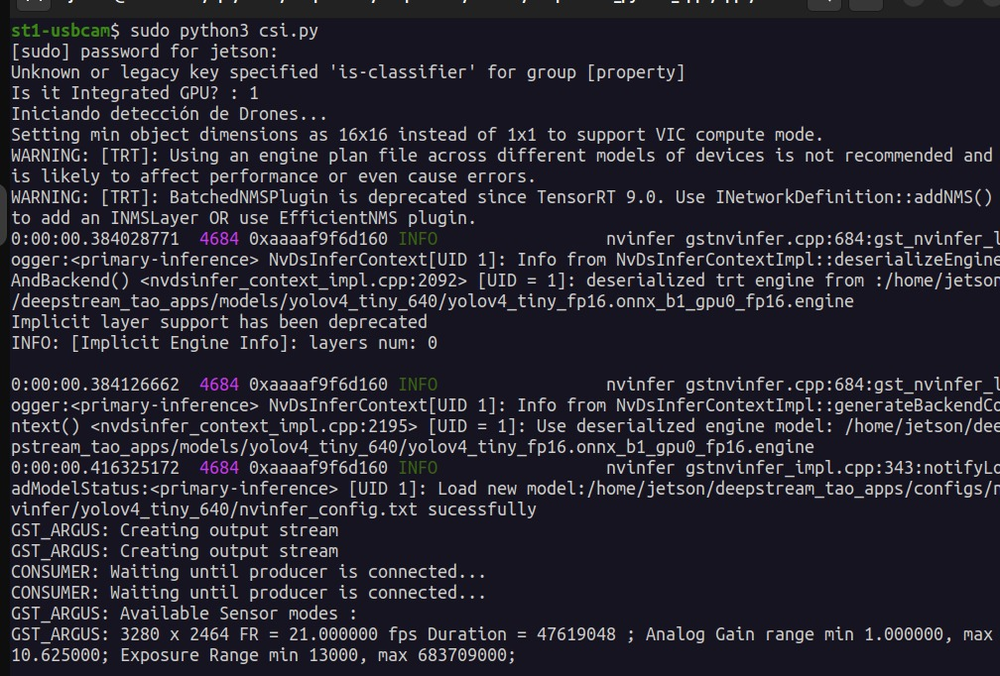
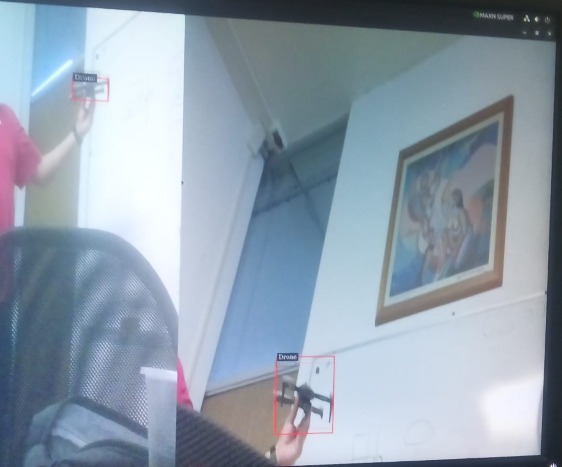

# 📷 Configuración de Cámara CSI con Deepstream y YOLO


```python
import sys
sys.path.append('../')
import gi
gi.require_version('Gst', '1.0')
from gi.repository import GLib, Gst
from common.platform_info import PlatformInfo
from common.bus_call import bus_call
import pyds

# --- CONFIGURACIÓN ---
# Ajusta este ID según el orden en tu archivo de etiquetas (labels.txt)
PGIE_CLASS_ID_DRONE = 0 

NUM_CAMERAS = 2
OUTPUT_WIDTH = 1920
OUTPUT_HEIGHT = 1080
MUXER_BATCH_TIMEOUT_USEC = 33000

def osd_sink_pad_buffer_probe(pad, info, u_data):
    gst_buffer = info.get_buffer()
    if not gst_buffer:
        print("Unable to get GstBuffer")
        return Gst.PadProbeReturn.OK

    batch_meta = pyds.gst_buffer_get_nvds_batch_meta(hash(gst_buffer))
    l_frame = batch_meta.frame_meta_list
    
    while l_frame is not None:
        try:
            frame_meta = pyds.NvDsFrameMeta.cast(l_frame.data)
        except StopIteration:
            break

        drone_count = 0
        l_obj = frame_meta.obj_meta_list
        
        while l_obj is not None:
            try:
                obj_meta = pyds.NvDsObjectMeta.cast(l_obj.data)
            except StopIteration:
                break
            
            # Solo contamos si es la clase Drone
            if obj_meta.class_id == PGIE_CLASS_ID_DRONE:
                drone_count += 1
            
            try:
                l_obj = l_obj.next
            except StopIteration:
                break

        # Configurar texto en pantalla (OSD)
        display_meta = pyds.nvds_acquire_display_meta_from_pool(batch_meta)
        display_meta.num_labels = 1
        py_nvosd_text_params = display_meta.text_params[0]
        
        # Texto simplificado solo para Drones
        py_nvosd_text_params.display_text = "Drones Detectados={}".format(
            frame_meta.source_id, drone_count)

        # Estética del texto
        py_nvosd_text_params.x_offset = 10
        py_nvosd_text_params.y_offset = 12
        py_nvosd_text_params.font_params.font_name = "Arial"
        py_nvosd_text_params.font_params.font_size = 14
        py_nvosd_text_params.font_params.font_color.set(1.0, 1.0, 1.0, 1.0) # Blanco
        py_nvosd_text_params.set_bg_clr = 1
        py_nvosd_text_params.text_bg_clr.set(0.0, 0.5, 0.0, 0.7) # Fondo verde semi-transparente

        pyds.nvds_add_display_meta_to_frame(frame_meta, display_meta)
        
        try:
            l_frame = l_frame.next
        except StopIteration:
            break
            
    return Gst.PadProbeReturn.OK

def main():
    Gst.init(None)
    platform_info = PlatformInfo()

    pipeline = Gst.Pipeline()
    if not pipeline:
        sys.stderr.write(" Unable to create Pipeline \n")

    # 1. StreamMux
    streammux = Gst.ElementFactory.make("nvstreammux", "Stream-muxer")
    pipeline.add(streammux)

    # 2. Fuentes de Cámara CSI
    for i in range(NUM_CAMERAS):
        source = Gst.ElementFactory.make("nvarguscamerasrc", f"src-cam-{i}")
        source.set_property('sensor-id', i)
        
        caps = Gst.ElementFactory.make("capsfilter", f"caps-cam-{i}")
        caps.set_property('caps', Gst.Caps.from_string("video/x-raw(memory:NVMM), width=1920, height=1080, format=NV12, framerate=30/1"))
        
        pipeline.add(source)
        pipeline.add(caps)
        source.link(caps)
        
        sinkpad = streammux.request_pad_simple(f"sink_{i}")
        srcpad = caps.get_static_pad("src")
        srcpad.link(sinkpad)

    streammux.set_property('width', 1920)
    streammux.set_property('height', 1080)
    streammux.set_property('batch-size', NUM_CAMERAS)
    streammux.set_property('batched-push-timeout', MUXER_BATCH_TIMEOUT_USEC)
    streammux.set_property('live-source', 1)

    # 3. Inferencia (YOLO Drone)
    pgie = Gst.ElementFactory.make("nvinfer", "primary-inference")
    # Asegúrate de que esta ruta sea correcta
    pgie.set_property("config-file-path", "/home/jetson/deepstream_tao_apps/configs/nvinfer/yolov4_tiny_640/nvinfer_config.txt")

    # 4. Tiler (Grid)
    tiler = Gst.ElementFactory.make("nvmultistreamtiler", "nvtiler")
    tiler.set_property("rows", 1)
    tiler.set_property("columns", NUM_CAMERAS)
    tiler.set_property("width", OUTPUT_WIDTH)
    tiler.set_property("height", OUTPUT_HEIGHT)

    # 5. Convertidor y OSD
    nvvidconv = Gst.ElementFactory.make("nvvideoconvert", "convertor")
    nvosd = Gst.ElementFactory.make("nvdsosd", "onscreendisplay")

    # 6. Sink
    if platform_info.is_integrated_gpu():
        sink = Gst.ElementFactory.make("nv3dsink", "nv3d-sink")
    else:
        sink = Gst.ElementFactory.make("nveglglessink", "nvvideo-renderer")
    sink.set_property('sync', False)

    # Añadir y vincular
    elements = [pgie, tiler, nvvidconv, nvosd, sink]
    for el in elements: pipeline.add(el)

    streammux.link(pgie)
    pgie.link(tiler)
    tiler.link(nvvidconv)
    nvvidconv.link(nvosd)
    nvosd.link(sink)

    loop = GLib.MainLoop()
    bus = pipeline.get_bus()
    bus.add_signal_watch()
    bus.connect("message", bus_call, loop)

    # Probe para el texto
    osdsinkpad = nvosd.get_static_pad("sink")
    osdsinkpad.add_probe(Gst.PadProbeType.BUFFER, osd_sink_pad_buffer_probe, 0)

    print("Iniciando detección de Drones...")
    pipeline.set_state(Gst.State.PLAYING)
    try:
        loop.run()
    except Exception as e:
        print(f"Error: {e}")
    finally:
        pipeline.set_state(Gst.State.NULL)

if __name__ == '__main__':
    main()
```

### 3. Inicialización del Sistema
Para arrancar el proyecto, ejecutamos los comandos de inicialización en la terminal de la Jetson. Esto permite cargar las librerías de NVIDIA y el modelo correctamente.



---

### 4. Prueba de Funcionamiento (Resultado Final)
Captura del sistema operando en tiempo real. Se puede observar el conteo de drones sobre el feed de la cámara CSI gracias a la integración de metadatos en el OSD.

